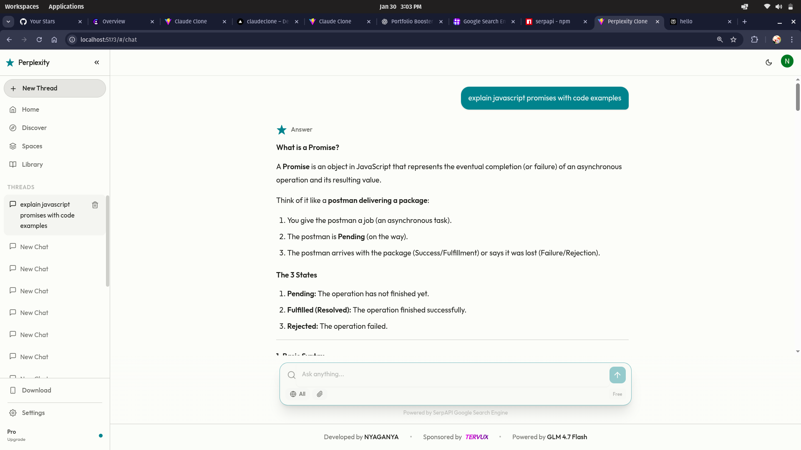
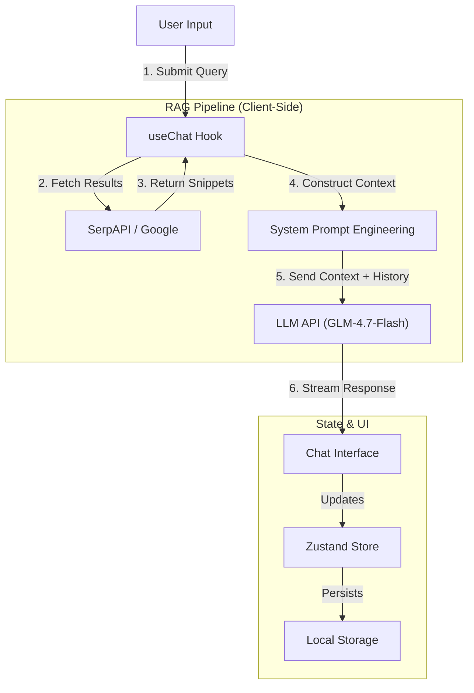

# Proseth Clone


<br/>



## Project Overview

**Proseth Clone** is a high-fidelity reconstruction of the Proseth AI search interface, engineered to demonstrate advanced frontend capabilities and system design. Unlike a standard chatbot, this application functions as a **Retrieval-Augmented Generation (RAG)** engine. It actively searches the web to find real-time information, synthesizes it into a coherent answer, and provides precise citations for every claim.

This project showcases the ability to build complex, data-intensive applications with a focus on performance, user experience, and clean architectural patterns.

---

## Key Features & Functionality

### 1. Retrieval-Augmented Generation (RAG)
The core content engine does not rely solely on pre-trained knowledge.
*   **Workflow**: User Query -> **SerpAPI** (Google Search) -> Context Extraction -> **LLM** (GLM-4.7-Flash) -> Streaming Response.
*   **Benefit**: Answers are up-to-date and fact-checked against real-time web results.

### 2. Intelligent Search Aggregation
*   Integrates **SerpAPI** to fetch organic search results, news, and knowledge graphs.
*   Processes and filters results to extract relevant snippets for the LLM context window.
*   Displays sources in a carousel for transparency, allowing users to verify information directly.

### 3. Advanced Markdown & Code Rendering
*   Custom-built Markdown renderer using `react-markdown` and `rehype-highlight`.
*   **Syntax Highlighting**: Auto-detects code languages and applies **Atom One Dark** (in dark mode) or **Docco** (in light mode) themes.
*   **Smart Copying**: Code blocks feature one-click copy functionality with visual feedback.

### 4. Robust State Management
*   Uses **Zustand** for global state, managing chat history, active sessions, and UI preferences.
*   **Persistence**: Automatically saves conversation history to local storage, ensuring users pick up exactly where they left off.

### 5. Secure Authentication
*   Integrated **Clerk** authentication for secure sign-up, sign-in, and session management.
*   Protects routes and associates chat history with specific user identities.

---

## Technical Architecture

The application follows a modular, component-driven architecture designed for scalability.



---

## Project Structure

The project is organized to separate concerns (UI vs. Logic vs. State).

```text
src/
├── assets/             # Static assets (images, global styles)
├── components/         # Reusable UI components
│   ├── ChatInput.tsx   # Auto-resizing text area with submit logic
│   ├── ChatMessage.tsx # Complex renderer for Markdown/Sources/Citations
│   ├── Sidebar.tsx     # Collapsible navigation & history management
│   └── ...
├── hooks/              # Custom React hooks
│   └── useChat.ts      # Core RAG logic orchestration
├── lib/                # Utilities and API clients
│   ├── openai.ts       # Typed client for LLM interaction
│   ├── search.ts       # Search engine API integration layer
│   ├── store.ts        # Global state definition (Zustand)
│   └── utils.ts        # Helper functions (CN, formatting)
├── pages/              # Route-level page components
│   ├── Auth.tsx        # Authentication wrapper
│   ├── Chat.tsx        # Main application layout
│   └── Welcome.tsx     # Landing page state
├── App.tsx             # Routing & Auth protection logic
└── main.tsx            # Application entry point
```

---

## Technology Stack Justification

### React 19 & Vite
Chosen for the modern concurrent features and lightning-fast HMR (Hot Module Replacement). Vite ensures the development experience remains snappy even as the codebase grows.

### TypeScript
Strict type safety is enforced throughout the application. Interfaces for `Message`, `Source`, and `Conversation` ensure data consistency between the search API, LLM, and UI components, preventing runtime errors.

### Tailwind CSS
Utility-first CSS allows for rapid UI iteration and pixel-perfect replication of the original design. It also simplifies the implementation of the dynamic Dark/Light mode system using CSS variables.

### Zustand
Selected over Redux for its minimal boilerplate and intuitive hook-based API. It handles the complex logic of chat history and active conversation switching without unnecessary complexity.

### Clerk
Provides enterprise-grade authentication out of the box, handling security concerns (sessions, tokens, encryption) so development could focus on core product features.

---

## Why Hire Me?

This project demonstrates specific competencies relevant to a Senior Frontend Engineer role:

1.  **System Design**: I didn't just build a UI; I architected a functional RAG pipeline on the client side, handling asynchronous data dependencies (Search -> LLM) efficiently.
2.  **Complex State**: The application manages fleeting UI state (loading, error) alongside persistent data (chat history, preferences) seamlessly.
3.  **Attention to Detail**: From the specific border colors in dark mode to the responsive behavior of code blocks on mobile, every interaction is polished.
4.  **Modern Standards**: The code utilizes the latest React patterns (Hooks, Custom Hooks), functional programming, and strictly typed TypeScript.

---

## Getting Started

To run this project locally:

1.  **Clone the repository**
    ```bash
    git clone https://github.com/JonniTech/Proseth-Clone.git
    cd Proseth-Clone
    ```

2.  **Install dependencies**
    ```bash
    npm install
    ```

3.  **Configure Environment Variables**
    Create a `.env` file in the root directory:
    ```env
    VITE_CLERK_PUBLISHABLE_KEY=pk_test_...
    VITE_ZAI_API_KEY=your_glm_api_key...
    VITE_SERPAPI_KEY=your_serpapi_key...
    ```

4.  **Run Development Server**
    ```bash
    npm run dev
    ```

---

## Technical Proficiency Statement

This clone is more than just a code exercise; it is a **direct indicator of my engineering capabilities**. 

It demonstrates my ability to:
*   Architect complex, component-driven frontend systems.
*   Integrate third-party APIs into seamless user experiences.
*   Manage application state at scale.
*   Deliver polished, production-ready logical solutions.

I built this to show that I can hit the ground running and contribute high-quality code to your team from day one.
